# Crowdfunding-Platform-with-Integrated-Software-Testing

### Project Output: 
Sampradan (A Block-Chain based Crowdfunding Web Platform) will be a website where people can donate and get donations easily.

### Software Process Model:
We have used Agile Methodology for software process models. Agile process model is the best choice for blockchain-based crowdfunding platform. As it focuses on iterative development, collaboration, and flexibility. This methodology is well-suited for blockchain projects as it allows for frequent feedback and adjustments, which is necessary for developing a complex and constantly evolving technology like blockchain. We particularly used Scrum, which is an agile framework for managing and completing complex projects, particularly in software development. The framework is based on an iterative and incremental approach to project management, where the project is divided into smaller and more manageable parts, called sprints. The Scrum framework emphasizes flexibility, continuous improvement, and collaboration. By breaking down the project into smaller parts and regularly reviewing progress and feedback, the Scrum framework can help teams adapt to changing requirements and deliver high-quality products in a timely manner

### Final Result of Project:
#### HomePage: 

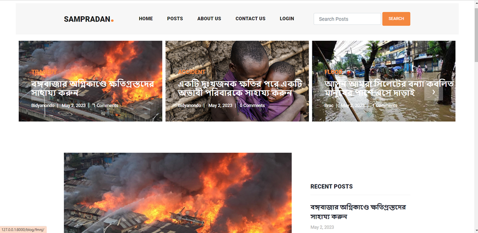

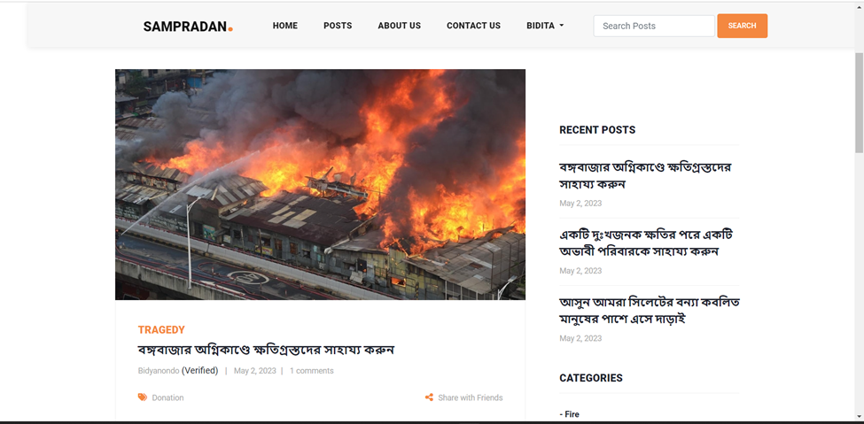

Note: In the home page, a user can see the running campaigns. 

#### Details of a campaign:

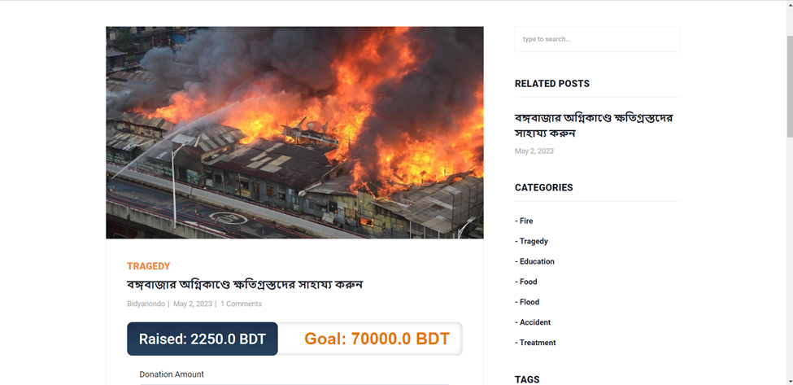

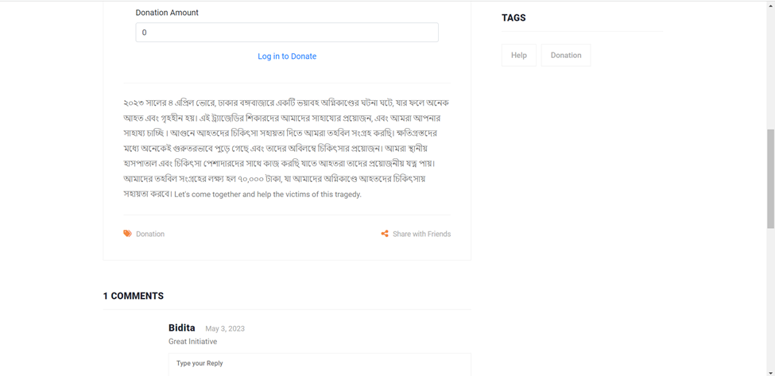

Note: A user can open a campaign and view the details of the campaign (Purpose, Amount want to rise, Amount they already raised etc)

#### Signup Page for user:

#### Signup Page for Organization:

#### Login Page:

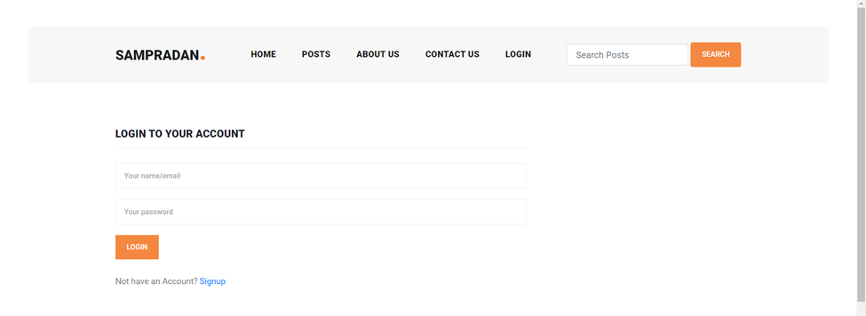

#### Signup Process for Organization in Blockchain:

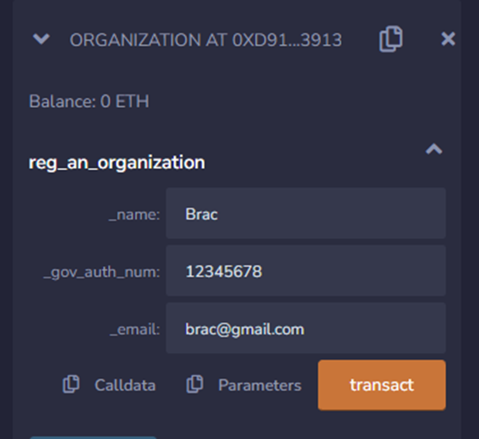

Note: Data of registration is stored on a block.

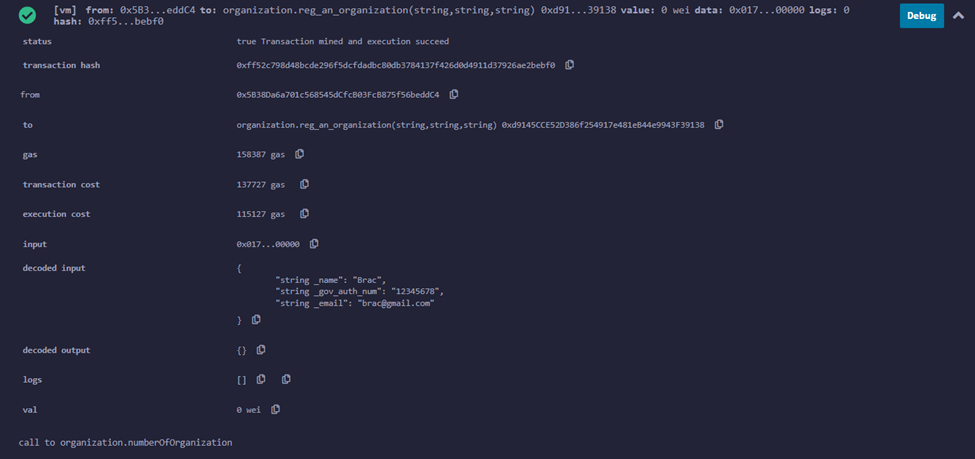

#### Verification Process for Public:

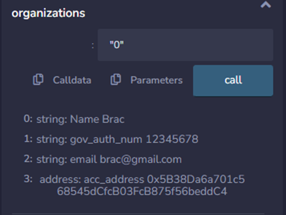

#### Create Campaign Section:

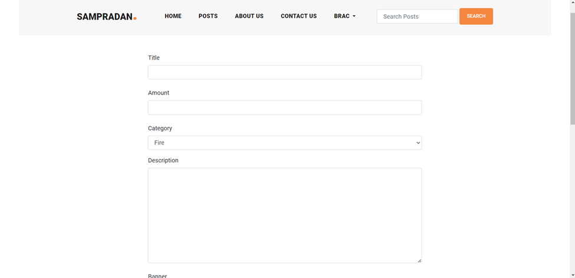

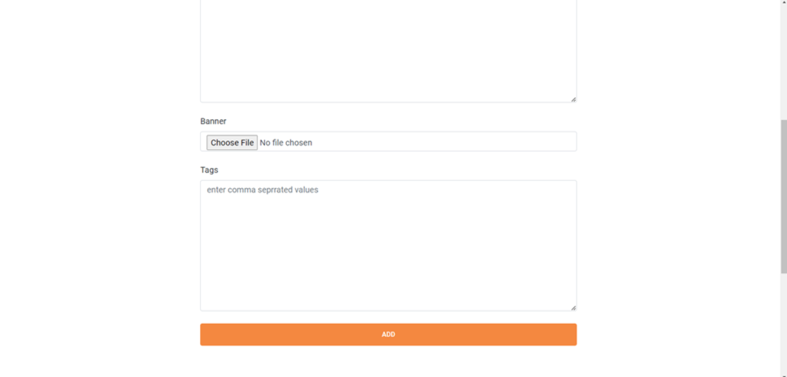

#### Donation System:

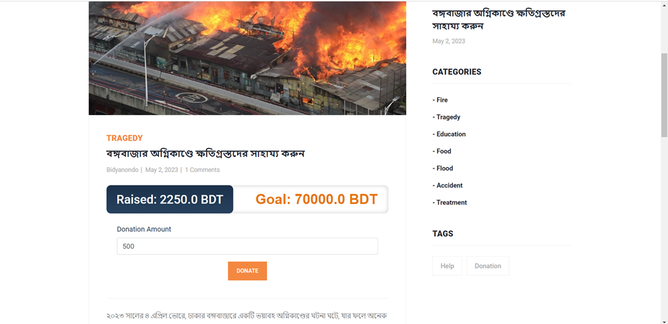

#### Payment Options:

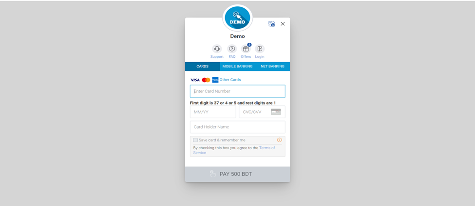

Note: Donation is received through payment gateway. Also, Amount updated.

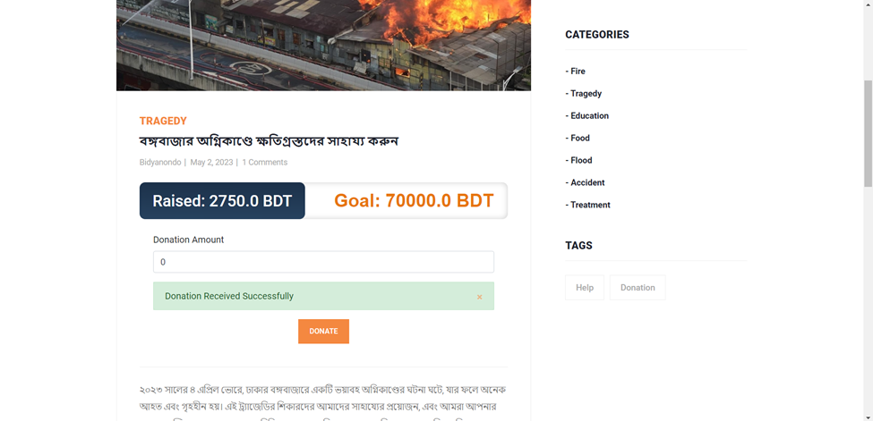

#### About Us Page:

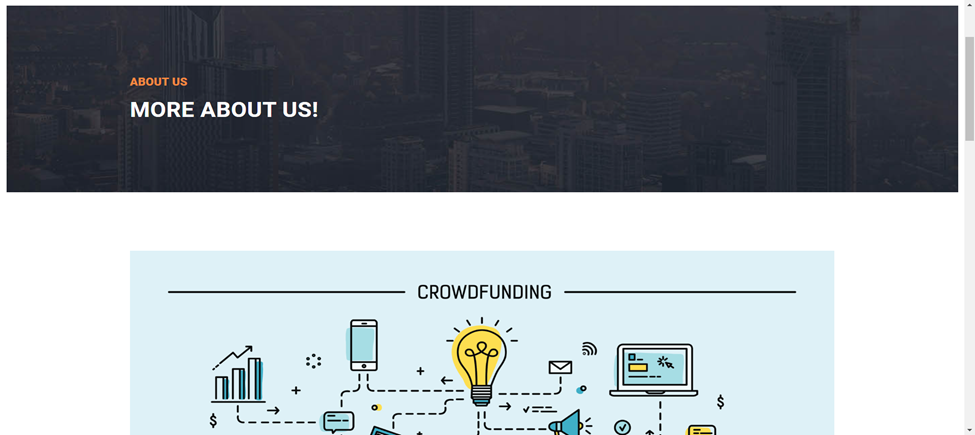

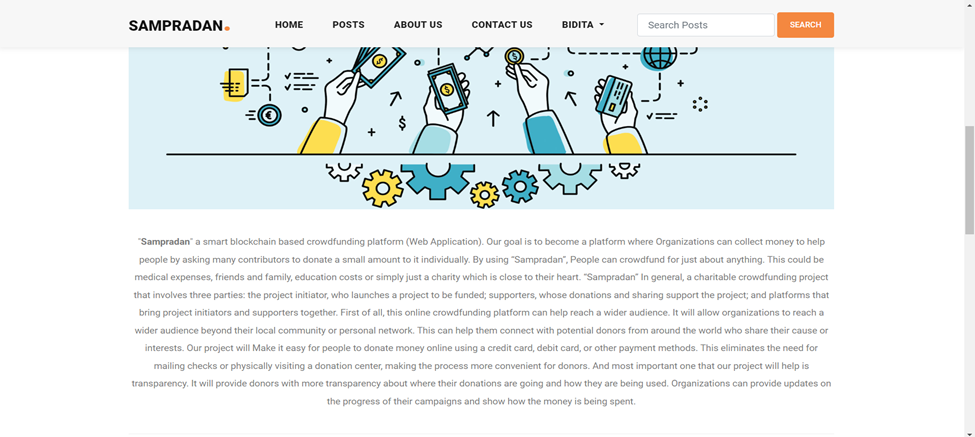

#### Contact Us Page:

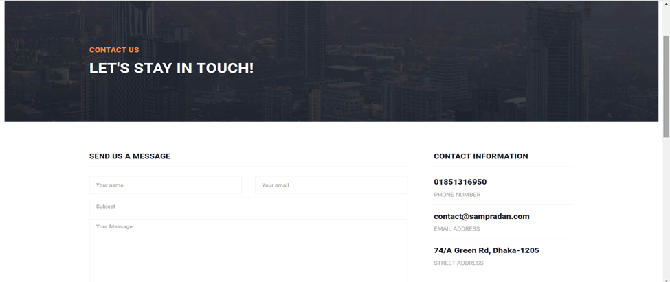

#### All Campaigns Page:

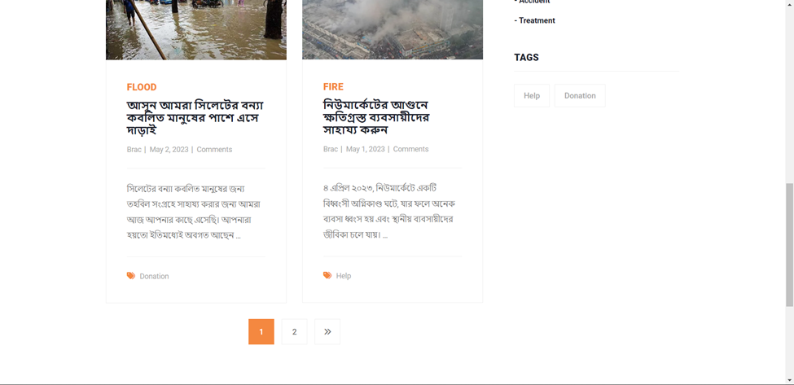

#### Organization:

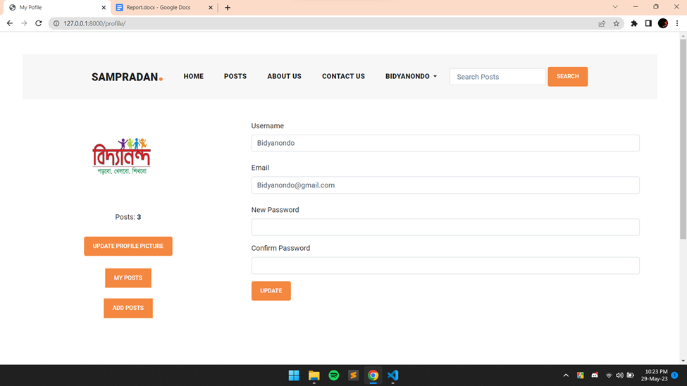

#### Search Campaigns:

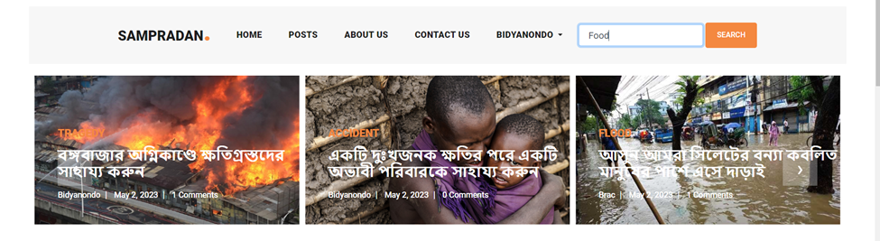

**Requirement Analysis:** Our platform will provide increased transparency, decentralization, smart contract automation, lower fees, and global reach. These project outputs can help organizations achieve their fundraising goals more effectively and efficiently. There are two types of requirements in our project.
   
**Basic Requirement:** The basic requirements for our blockchain-based crowdfunding system can include the following:  
● User registration: Users should be able to create an account and provide their personal information, including their name, email address, and payment information.  
● Campaign submission: Campaign creators should be able to submit their crowdfunding campaigns and include information such as campaign description, funding goal, duration, and rewards for backers.   
● Payment processing: The system should be able to handle payment processing securely using cryptocurrencies or fiat currencies.   
● Smart contracts: Smart contracts should be developed to automate the crowdfunding process, ensuring that funds are released only when certain conditions are met.  
● Campaign progress tracking: The system should allow campaign creators to track the progress of their crowdfunding campaign, including the amount of funds raised and the percentage of the funding goal achieved.  
● Transparency and security: The system should be designed to provide transparency and security for all stakeholders, including project creators, backers, and the platform operator.  
● Platform fees: The system should allow the platform operator to charge fees for using the platform.  
● Reporting and analytics: The system should provide reporting and analytics functionality to allow campaign creators and the platform operator to track key metrics such as the success rate of crowdfunding campaigns.  

**Functional Requirements:** Functional requirements for a blockchain-based crowdfunding system could include:  
● User authentication: The system should allow users to authenticate themselves to access their accounts and perform various actions within the system, such as creating and backing projects.  
● Campaign creation: The system should allow project creators to create and submit their crowdfunding projects, including details such as the project name, description, funding goal, duration, and rewards for backers.  
● Campaign browsing: The system should allow users to browse and search for campaigns based on various criteria, such as campaign category, funding goal, and duration.  
● Smart contract execution: The system should use smart contracts to automatically execute crowdfunding agreements, releasing funds to campaign creators only when specific conditions are met, such as the campaign reaching its funding goal.  
● Payment processing: The system should enable secure and transparent payment processing, allowing users to make payments using cryptocurrencies or fiat currencies.  
● Feedback and ratings: The system should allow users to provide feedback and ratings on projects and project creators, helping to build trust and transparency within the community.  
● User management: The system should allow platform operators to manage user accounts, including adding or removing users, modifying user details, and managing user roles and permissions.  
● Reporting and analytics: The system should provide reporting and analytics functionality to allow project creators and platform operators to track key metrics such as the success rate of crowdfunding campaigns, the number of backers, and the amount of funds raised.  

### Methodology: 
MVC design pattern is a software architecture pattern that separates an application into three interconnected components: the model, the view, and the controller. 

**Model:** The model represents the data and business logic of your application. It manages the interaction with the blockchain and handles tasks such as project creation, donation management, and transaction processing. The model includes:  
    **Campaign Model:** Manages the data and operations related to crowdfunding campaigns. It handles tasks such as creating new campaigns, updating campaign information, and retrieving campaign details.  
    **Donation Model:** Handles the donation-related operations, including accepting donations, managing donor information, and tracking the total amount raised for each project.  
    **Transaction Model:** Handles the processing transactions, verifying donations, and updating the ledger.

**View:** The view is responsible for presenting the data to the users and handling user interactions. In your case, the view will include various web pages and interfaces that allow users to browse projects, make donations, and view project updates. The view includes:  
    **ProjectListingView:** Displays a list of available projects, including their titles, descriptions, and funding progress. It allows users to browse through the projects and select one for donation.  
    **DonationView:** Provides a form or interface for users to enter donation details, such as the amount they want to contribute and the payment method they prefer.  
    **ProjectDetailsView:** Displays detailed information about a selected project, including updates from the project initiator, transaction history, and progress towards the funding goal.

**Controller:** The controller acts as an intermediary between the model and the view. It handles user input, updates the model accordingly, and ensures the appropriate view is displayed. The controller includes:  
    **ProjectController:** Manages the flow of information and actions related to projects. It handles tasks such as creating new projects, updating project information, and retrieving project details to display on the views.  
    **DonationController:** Handles user interactions related to donations, including accepting donation details from the view, updating the donation model, and processing the transaction using the transaction model.  
    **ViewController:** Controls the navigation between different views based on user actions, such as selecting a project, making a donation, or viewing project details.

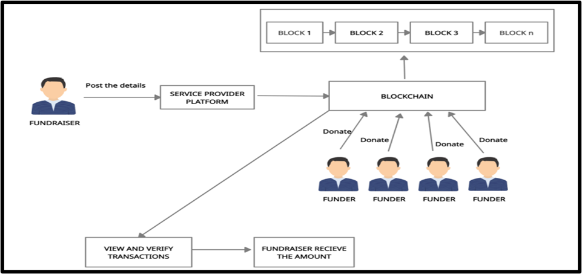

Figure 1: Model-View-Controller (MVC)  

Figure 1 represents the modules involved in this project are Registration-Fundraiser, Registration-Funder, Service provider platform, Transaction platform, Blockchain creating and mining.  

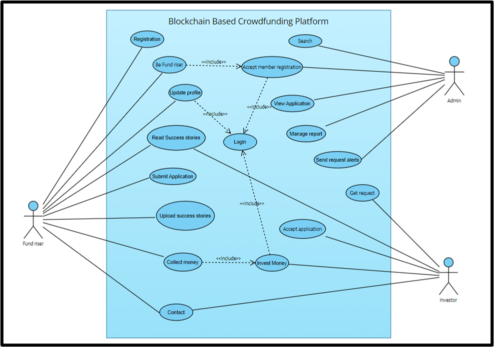

Figure 2: The UML diagram  

#### Conclusion: 
As the world is moving towards Web 3.0 and decentralized systems to solve their daily problems, it is important to test and build new alternative architectures that show us the ideology to provide innovative solutions. With the existing solutions in the crowdfunding world created and handled by intermediary corporations that have a say on various parameters of a campaign, the alternative solution based on peer-to-peer network handling the campaign transactions seems ripe. This project explores ways to remove intermediaries in a crowdfunding business use case. This was done with the help of smart contracts, written for the crowdfunding dapp application deployed in Ethereum blockchain, that guide the execution of a transaction. This interaction allows users to create and invest ether into campaigns that interest them. Without much effort campaign creators and campaign investors can perform their intended activities using the crowdfunding platform. There are new emerging blockchain platforms such as EOS, Stellar, Cardano and NEO that provide more language choices and platform configuration choices compared to Ethereum but these platforms haven’t proved themselves yet. EOS looks like a promising platform and in future this project can be moved to EOS if it proves to be a better choice than Ethereum.
